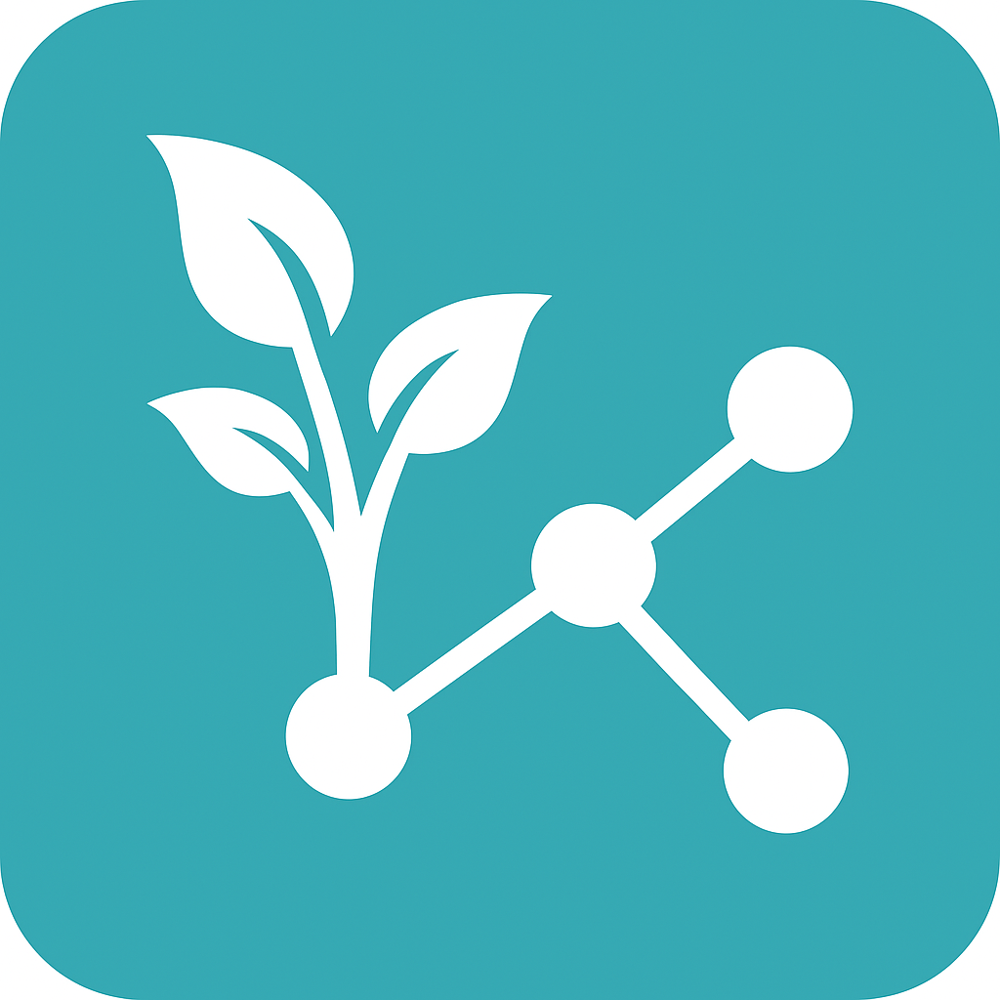

# 

# PhyloGraph – Visualisation interactive de gènes, traits et graphes RDF
### Graph-based semantic viewer for gene-to-trait relationships

---


---

## Scientific Abstract / Résumé scientifique

**PhyloGraph** is a scientific web interface for dynamically visualizing and querying semantic associations between genes and traits using RDF and ontology standards. Designed for the **BReIF** and **AgroDiv** projects under the **PEPR Agroécologie et Numérique**, PhyloGraph helps researchers explore complex biological relationships in a visually interactive, semantically interoperable and FAIR-compliant way.

> Ce projet vise à fédérer les connaissances autour des relations fonctionnelles gène-trait au sein de graphes RDF, en s'appuyant sur des ontologies comme TO et sur l’interopérabilité avec les grandes plateformes INRAE (SyntenyViewer, FAIDARE...).

---

## Architecture

```
CSV/API Input ➔ RDF Graph ➔ SPARQL/NLQ Panel ➔ Visual Graph
                      ➨                        ⟦
         Federation APIs (FAIDARE, Neo4j, etc.)
```

---

## Interopérabilité / Interoperability

PhyloGraph supports integration and future federation with:

| Platform        | Description                                  |
|----------------|----------------------------------------------|
| **SyntenyViewer** | Gène ➔ Synténie ➔ Trait linking             |
| **FAIDARE**     | Germplasm & phenotype FAIR APIs               |
| **AgroPortal**  | TO Ontology validation / metadata              |
| **Neo4j (planned)** | Native RDF-to-GraphDB export               |
| **ELIXIR-FR**   | RDF alignment with national bioportal         |

---

## Technologies Used

| Layer           | Technologies |
|----------------|--------------|
| **Frontend**   | React, Vite, TailwindCSS, Framer Motion, Lucide Icons |
| **Backend**    | FastAPI (Python), RDFLib, SPARQL endpoint, CORS |
| **Semantic Web** | RDF/Turtle, TO Ontology, SPARQLWrapper, JSON-LD |
| **Graph DB / Viz** | Cytoscape.js, Neo4j (planned), CSV-to-RDF, Turtle import |
| **AI / NLP**    | Mistral LLM integration (via `/ask`), natural language query |
| **Extras**     | RDF export/download, RDF injection from API, CSV parsers |

---

## Features

- Visualise gène ➔ trait ➔ ontology links
- Ask questions with LLM (via `/ask`)
- SPARQL panel with query builder
- Export RDF (Turtle)
- Convert CSV ➔ RDF, SQL, Neo4j
- RDF ➔ SPARQL, JSON-LD ➔ RDF, TTL ➔ Graph
- Full right-panel UX for converters & results
- FAIDARE + SyntenyViewer federation-ready

---

## API Endpoints

| Endpoint                | Description                             |
|-------------------------|-----------------------------------------|
| `POST /graph`           | Inject gene ➔ trait data as RDF triples |
| `GET /rdf`              | Export current RDF graph as Turtle      |
| `POST /sparql`          | Execute a SPARQL query                  |
| `POST /ask`             | Ask an LLM to generate SPARQL from NLQ |
| `POST /validate_trait`  | Validate a TO label to get URI         |
| `POST /csv-to-rdf`      | Convert CSV to RDF on backend (planned) |

---

## Installation & Local Dev

### 1. Clone the project
```bash
git clone https://github.com/sergueigorbounov/PhyloGraph.git
cd PhyloGraph
```

### 2. Setup Backend
```bash
cd backend
conda env create -f environment.yml
conda activate phylograph
uvicorn api:app --reload
```
Visit: http://localhost:8000/docs

### 3. Setup Frontend
```bash
cd frontend
npm install axios react-cytoscapejs
npm install
npm run dev
```
Visit: http://localhost:5173

---

## API Sample: POST /graph

```json
[
  {
    "gene_id": "AT1G01010",
    "gene_label": "Gene1",
    "trait_label": "Drought tolerance",
    "trait_uri": "http://purl.obolibrary.org/obo/TO_0006001",
    "species": "Arabidopsis thaliana"
  }
]
```

---

## Citation & Metadata

If you use **PhyloGraph** in your research or project, please cite:

```bibtex
@misc{phylograph2025,
  title={PhyloGraph: FAIR Semantic Gene-Trait Explorer for Translational Plant Genomics},
  author={Flores, Raphaël and Gorbounov, Sergueï},
  institution={INRAE, URGI & CNRGV},
  year={2025},
  url={https://github.com/sergueigorbounov/PhyloGraph}
}
```

---

## Roadmap / Perspectives

| Phase     | Planned Enhancements                                  |
|-----------|--------------------------------------------------------|
| **v0.3**  | CSV ➔ RDF backend API + SHACL validation             |
| **v0.4**  | Neo4j export + full-text search (Elasticsearch)       |
| **v0.5**  | Federated SPARQL (FAIDARE / SyntenyViewer)            |
| **v0.6+** | Named Graphs, RDF diff viewer, SPARQL autocompletion  |

---

## Project Context

Developed at **CNRGV@Toulouse** for **URGI@Versailles**, INRAE  
Part of the **BReIF** and **AgroDiv** projects  
Supervised by [Raphaël FLORES](https://urgi.versailles.inrae.fr)

> Built for INRAE platforms & scientists. FAIR, semantic, modular, open.

---

## License

MIT License — 2025 INRAE  
For public research, education, and interoperability

